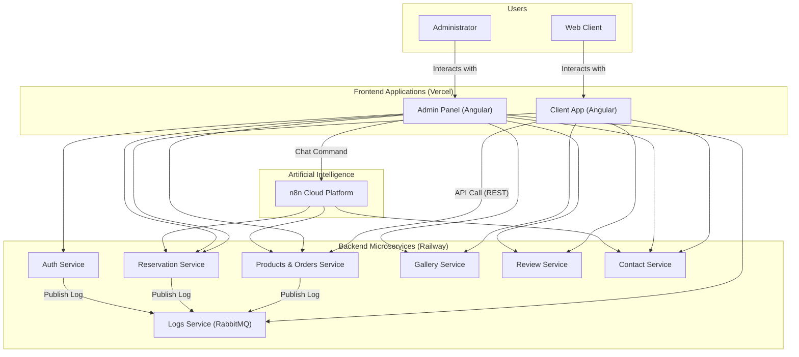

# AI-Powered Restaurant Management System

### A modern, microservices-based platform for restaurant management, developed as a Bachelor's Thesis project.

[](https://www.java.com)
[](https://spring.io/projects/spring-boot)
[](https://angular.io/)
[](https://www.docker.com/)

This project is a complete, full-stack software solution that demonstrates the application of a microservices architecture to manage restaurant operations. The system integrates artificial intelligence agents to automate key tasks such as processing orders and reservations via voice interactions.

## System Architecture

The diagram below provides a high-level overview of the system's main components and their interactions.



## Key Features

### Client Application (Public)
- Interactive menu viewing with filtering and search capabilities.
- Reservation creation through an intuitive form.
- Restaurant photo gallery viewer.
- Submission of reviews and feedback.
- **AI Integration:** Ability to request a phone call to place an order or make a reservation, handled by a conversational AI agent.

### Admin Panel
- Secure authentication based on JSON Web Tokens (JWT).
- Analytical dashboard with real-time statistics and charts.
- Full CRUD (Create, Read, Update, Delete) management for products, categories, and ingredients.
- Centralized management for orders and reservations.
- **AI Integration:** An administrative chatbot that can execute tasks (e.g., generate reports) based on natural language commands.

## Technology Stack

### Backend
- **Java 17** & **Spring Boot 3**
- **Spring Security** (JWT Authentication)
- **Spring Data JPA** & **Hibernate**
- **Microservices Architecture** (7 services)
- **Lombok**

### Frontend
- **Angular 18+** & **TypeScript**
- **RxJS** for reactive programming and state management.
- **Angular Material** for UI components.

### Databases & Messaging
- **MySQL** (using the "Database per Service" pattern)
- **RabbitMQ** (for asynchronous logging)

### AI & Automation
- **n8n.io** (workflow orchestration platform)
- **ElevenLabs API** (for conversational voice AI)
- **Google Gemini API** (for Natural Language Understanding)

### DevOps & Hosting
- **Docker** & **Docker Compose** (for containerization and local execution)
- **Railway** (for hosting backend microservices)
- **Vercel** (for hosting frontend applications)

## Project Structure

The repository is organized as a monorepo, with separate folders for each component of the system:
```
/
├── authentication-service/   # Authentication Microservice
├── products-service/         # Products & Orders Microservice
├── reservation-service/      # Reservation Microservice
├── ... (other services) ...
├── frontend-client-app/      # Angular application for clients
└── frontend-admin-app/       # Angular application for the admin panel
```

## Getting Started Locally

### Prerequisites
- Java JDK 17+
- Maven 3.8+
- Node.js 18+
- Docker & Docker Compose
- A local MySQL Server instance

### Installation Steps
1.  **Clone the repository:**
    ```bash
    git clone [YOUR_REPOSITORY_URL]
    cd [repository-name]
    ```
2.  **Backend Setup:**
    - Ensure your local MySQL server is running.
    - Create the necessary database schemas for each microservice.
    - Update the `application.properties` files in each microservice with your local database credentials.
3.  **Run the Backend:**
    - (Recommended) Use the provided `docker-compose.yml` file to start all microservices with a single command.
    - Alternatively, navigate to each microservice folder and run `mvn spring-boot:run`.
4.  **Run the Frontend:**
    - Navigate to one of the frontend application folders (e.g., `frontend-admin-app`).
    - Run `npm install` to install dependencies.
    - Run `ng serve` to start the development server. The application will be available at `http://localhost:4200/`.
    - Repeat the steps for the other frontend application.
